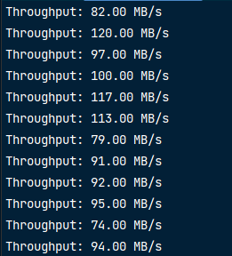

## TurboLoad

Additional service for your website to diversify your main server with the downloading process.
 
If you deal with a lot of downloads this service may benefit you by faster download speed for your
customers, which in turn is better User Experience.  
Currently, it serves only 1 file with size 10 GB, but you can ask me to implement more handlers
for different files, interaction with database, or any other updates.

> Downloading speed in is average: 70-80 mbps; Maximal speed was 120 mbps;

## Methodology
> Tests were performed 10-100 times with file of size 1 GB \n

### 1 GB file
> 1 connection - file downloads in 5 seconds   
> 10 simultaneous connections - download is 10-15 seconds  
> 100 concurrent requests - download time approaches 1 minute   

### 10 GB file
> 1 connection - file downloads in 80 seconds   
> 10 simultaneous connections - download is around 120-180 seconds  

[//]: # (> 100 concurrent requests - download time approaches 1 minute   )

Output: 

### Outcomes:
- By one user reported that using this service he reduced download time of 1 GB file to under 5 seconds.

Launch this service using:  
`git clone https://github.com/werniq/TurboLoad`
 
`cd mainserver`
 
`go build -o server.exe .`
 
`./server.exe`
 
