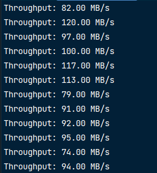

## TurboLoad

Additional service for your website to diversify your main server with the downloading process.
 
If you deal with a lot of downloads this service may benefit you by faster download speed for your
customers, which in turn is better User Experience.  
Currently, it serves only 1 file with size 10 GB, but you can ask me to implement more handlers
for different files, interaction with database, or any other updates.

> Downloading speed in is average: 60-70 mbps; Maximal speed was 120 mbps;

Output: 

Launch this service using:
>    go build -o server.exe .
>
>   ./server.exe